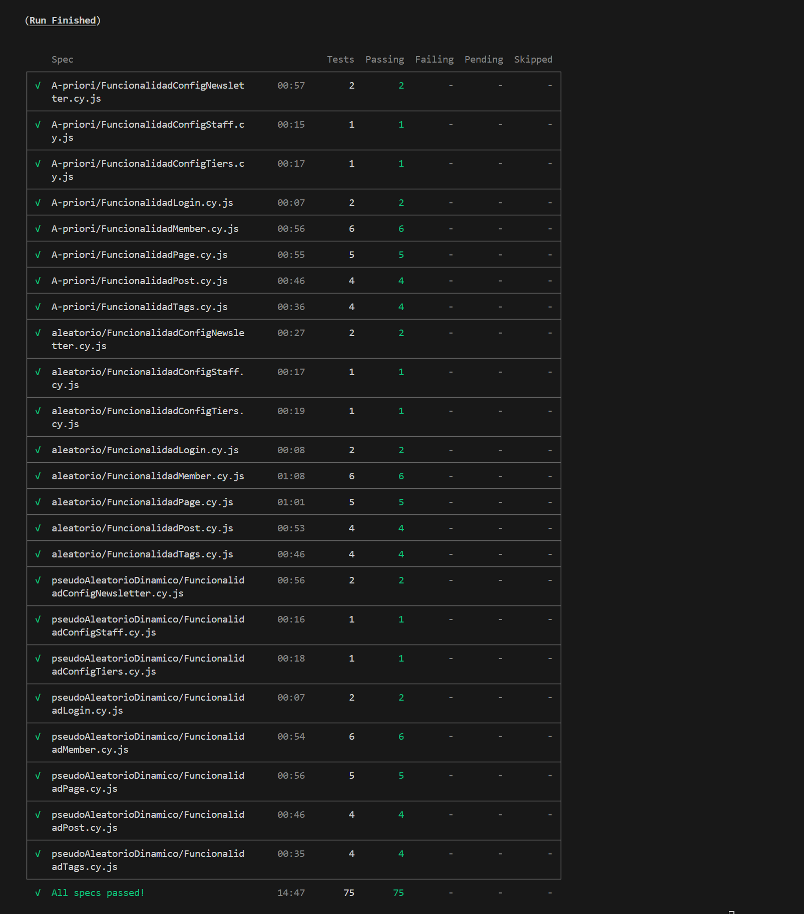

# CypressGhost

**Pruebas realizadas sobre ghost con Cypress:** En este repositorio están los escenarios y pruebas creadas con la herramienta Cypress para la aplicación bajo prueba.

## Requisitos:
* Node
* Ghost
* Docker
## Ambiente donde se comprobó la correcta ejecución:
* SO: _Windows 11_
* Node.js versión: _v20.18.0_
* npm versión: _10.9.0_
## Levantamiento de las imagenes docker de Ghost

#### Ghost 5.96.0 (Puerto: 2368)

Para ejecutar Ghost 5.96.0 haciendo uso de docker se pueden correr los siguientes comandos:

```
docker image pull ghost:5.96.0  
docker run -d --name Ghost5.96 -e NODE_ENV=development -e url=http://localhost:2368 -p 2368:2368 ghost:5.96.0
```

Ahora se debe crear el usuario administrador, para ello se debe ingresar a la siguiente url una vez la imagen se haya levantado:

```
http://localhost:2368/ghost/##/setup
```

Y se ingresan los siguientes datos:
* **email:** jd.garciaa1@uniandes.edu.co
* **password:** Pruebas123*

#### Instalación y ejecución

Una vez hecho lo anterior ya se tiene el back con las dos aplicaciones bajo prueba listas para las pruebas, para ejecutar estas pruebas puede hacer:

1. Instala las dependencias del proyecto, ubicándose en el directorio raíz ejecutamos:

```
npm install
```

Si desea ejecutar solo las pruebas mediante la interfaz de cypress:

```
npx cypress open
```

O si se desea ejecutar sin la interfaz, se ejecuta:

```
npx cypress run --headless
```
## Estrategias de generación de datos

Las estratégias de generación de datos implementadas en el proyecto son explicadas en la wiki del mismo, para su consulta, seguir el siguiente linl [Wiki: Generación de datos](https://github.com/jdanielkc/Semana7/wiki/Estrategias-Datapool)

## Funcionalidades Ghost 5.96.0:
#### Parte 1:
* Funcionalidad ConfigNewsletter
    - A-priori: FuncionalidadConfigNewsletter - E0001 Creando un nuevo newsletter
    - A-priori: FuncionalidadConfigNewsletter - E0002 Editando un newsletter
* Funcionalidad ConfigStaff
    - A-priori: FuncionalidadConfigStaff - E0003 Modificación del nombre de usuario
* Funcionalidad ConfigTiers
    - A-priori: FuncionalidadConfigTiers - E0004 Modificación tier free
* Funcionalidad Login
    - A-priori: FuncionalidadLogin - E0005 Verificando Inicio de sesión exitoso
    - A-priori: FuncionalidadLogin - E0006 Verificando inicio de sesión fallido
* Funcionalidad Member
    - A-priori: FuncionalidadMember - E0007 Añadiendo usuario administrativo como miembro
    - A-priori: FuncionalidadMember - E0008 Creando un nuevo miembro
    - A-priori: FuncionalidadMember - E0009 Creando un nuevo miembro con email no valido
    - A-priori: FuncionalidadMember - E0010 Creando un nuevo miembro con campo nota mayor a 500 caracteres
    - A-priori: FuncionalidadMember - E0011 Eliminando un miembro
    - A-priori: FuncionalidadMember - E0012 Eliminando miembro administrador
* Funcionalidad Page
    - A-priori: FuncionalidadPage - E0013 Creando Page con titulo y contenido
    - A-priori: FuncionalidadPage - E0014 Creando Page con titulo y sin contenido
    - A-priori: FuncionalidadPage - E0015 Eliminando una Page
    - A-priori: FuncionalidadPage - E0016 Editando una Page
    - A-priori: FuncionalidadPage - E0017 Creando un page con un titulo mayor a 255 caracteres
* Funcionalidad Post
    - A-priori: FuncionalidadPost - E0018 Creando un nuevo post
    - A-priori: FuncionalidadPost - E0019 Eliminando un post
    - A-priori: FuncionalidadPost - E0020 Editando un post
    - A-priori: FuncionalidadPost - E0021 Creando un post con un titulo mayor a 255 caracteres
* Funcionalidad Tags
    - A-priori: FuncionalidadTags - E0022 Creando un nuevo Tag
    - A-priori: FuncionalidadTags - E0023 Eliminando un Tag
    - A-priori: FuncionalidadTags - E0024 Editando un Tag
    - A-priori: FuncionalidadTags - E0025 Creando un tag con una descripción mayor a 500 caracteres

#### Parte 2

* Funcionalidad ConfigNewsletter
    - Aleatorio: FuncionalidadConfigNewsletter - E0001 Creando un nuevo newsletter
    - Aleatorio: FuncionalidadConfigNewsletter - E0002 Editando un newsletter
* Funcionalidad ConfigStaff
    - Aleatorio: FuncionalidadConfigStaff - E0003 Modificación del nombre de usuario
* Funcionalidad ConfigTiers
    - Aleatorio: FuncionalidadConfigTiers - E0004 Modificación tier free
* Funcionalidad Login
    - Aleatorio: FuncionalidadLogin - E0005 Verificando Inicio de sesión exitoso
    - Aleatorio: FuncionalidadLogin - E0006 Verificando inicio de sesión fallido
* Funcionalidad Member
    - Aleatorio: FuncionalidadMember - E0007 Añadiendo usuario administrativo como miembro
    - Aleatorio: FuncionalidadMember - E0008 Creando un nuevo miembro
    - Aleatorio: FuncionalidadMember - E0009 Creando un nuevo miembro con email no valido
    - Aleatorio: FuncionalidadMember - E0010 Creando un nuevo miembro con campo nota mayor a 500 caracteres
    - Aleatorio: FuncionalidadMember - E0011 Eliminando un miembro
    - Aleatorio: FuncionalidadMember - E0012 Eliminando miembro administrador
* Funcionalidad Page
    - Aleatorio: FuncionalidadPage - E0013 Creando Page con titulo y contenido
    - Aleatorio: FuncionalidadPage - E0014 Creando Page con titulo y sin contenido
    - Aleatorio: FuncionalidadPage - E0015 Eliminando una Page
    - Aleatorio: FuncionalidadPage - E0016 Editando una Page
    - Aleatorio: FuncionalidadPage - E0017 Creando un page con un titulo mayor a 255 caracteres
* Funcionalidad Post
    - Aleatorio: FuncionalidadPost - E0018 Creando un nuevo post
    - Aleatorio: FuncionalidadPost - E0019 Eliminando un post
    - Aleatorio: FuncionalidadPost - E0020 Editando un post
    - Aleatorio: FuncionalidadPost - E0021 Creando un post con un titulo mayor a 255 caracteres
* Funcionalidad Tags
    - Aleatorio: FuncionalidadTags - E0022 Creando un nuevo Tag
    - Aleatorio: FuncionalidadTags - E0023 Eliminando un Tag
    - Aleatorio: FuncionalidadTags - E0024 Editando un Tag
    - Aleatorio: FuncionalidadTags - E0025 Creando un tag con una descripción mayor a 500 caracteres

#### Parte 3:
* Funcionalidad ConfigNewsletter
    - pseudoaleatorio dinámico: FuncionalidadConfigNewsletter - E0001 Creando un nuevo newsletter
    - pseudoaleatorio dinámico: FuncionalidadConfigNewsletter - E0002 Editando un newsletter
* Funcionalidad ConfigStaff
    - pseudoaleatorio dinámico: FuncionalidadConfigStaff - E0003 Modificación del nombre de usuario
* Funcionalidad ConfigTiers
    - pseudoaleatorio dinámico: FuncionalidadConfigTiers - E0004 Modificación tier free
* Funcionalidad Login
    - pseudoaleatorio dinámico: FuncionalidadLogin - E0005 Verificando Inicio de sesión exitoso
    - pseudoaleatorio dinámico: FuncionalidadLogin - E0006 Verificando inicio de sesión fallido
* Funcionalidad Member
    - pseudoaleatorio dinámico: FuncionalidadMember - E0007 Añadiendo usuario administrativo como miembro
    - pseudoaleatorio dinámico: FuncionalidadMember - E0008 Creando un nuevo miembro
    - pseudoaleatorio dinámico: FuncionalidadMember - E0009 Creando un nuevo miembro con email no valido
    - pseudoaleatorio dinámico: FuncionalidadMember - E0010 Creando un nuevo miembro con campo nota mayor a 500 caracteres
    - pseudoaleatorio dinámico: FuncionalidadMember - E0011 Eliminando un miembro
    - pseudoaleatorio dinámico: FuncionalidadMember - E0012 Eliminando miembro administrador
* Funcionalidad Page
    - pseudoaleatorio dinámico: FuncionalidadPage - E0013 Creando Page con titulo y contenido
    - pseudoaleatorio dinámico: FuncionalidadPage - E0014 Creando Page con titulo y sin contenido
    - pseudoaleatorio dinámico: FuncionalidadPage - E0015 Eliminando una Page
    - pseudoaleatorio dinámico: FuncionalidadPage - E0016 Editando una Page
    - pseudoaleatorio dinámico: FuncionalidadPage - E0017 Creando un page con un titulo mayor a 255 caracteres
* Funcionalidad Post
    - pseudoaleatorio dinámico: FuncionalidadPost - E0018 Creando un nuevo post
    - pseudoaleatorio dinámico: FuncionalidadPost - E0019 Eliminando un post
    - pseudoaleatorio dinámico: FuncionalidadPost - E0020 Editando un post
    - pseudoaleatorio dinámico: FuncionalidadPost - E0021 Creando un post con un titulo mayor a 255 caracteres
* Funcionalidad Tags
    - pseudoaleatorio dinámico: FuncionalidadTags - E0022 Creando un nuevo Tag
    - pseudoaleatorio dinámico: FuncionalidadTags - E0023 Eliminando un Tag
    - pseudoaleatorio dinámico: FuncionalidadTags - E0024 Editando un Tag
    - pseudoaleatorio dinámico: FuncionalidadTags - E0025 Creando un tag con una descripción mayor a 500 caracteres
## Pruebas de funcionamiento



# KrakenGhost

**Pruebas realizadas sobre ghost con Kraken:** En este repositorio están los escenarios y pruebas creadas con la herramienta Kraken para la aplicación bajo prueba.

## Requisitos:
* Node
* Ghost
* Docker
## Ambiente donde se comprobó la correcta ejecución:
* SO: _Windows 11_
* Node.js versión: _v20.18.0_
* npm versión: _10.9.0_
## Levantamiento de las imagenes docker de Ghost

El levantamiento de la imagen docker se hace de forma similar a como se realizó en los pasos anteriores con cypress:

```
docker image pull ghost:5.96.0  
docker run -d --name Ghost5.96 -e NODE_ENV=development -e url=http://localhost:2368 -p 2368:2368 ghost:5.96.0
```

Ahora se debe crear el usuario administrador, para ello se debe ingresar a la siguiente url una vez la imagen se haya levantado:

```
http://localhost:2368/ghost/##/setup
```

Y se ingresan los siguientes datos:
* **email:** jd.garciaa1@uniandes.edu.co
* **password:** Pruebas123*

**NOTA:** Si ya se levantaron las imagenes en pasos anteriores, no es necesario ejecutar nuevamente los comandos docker.

#### Instalación y ejecución

Una vez hecho lo anterior ya se tiene el back con la aplicación bajo prueba lista para las pruebas, para ejecutar estas pruebas en kraken debe hacer:

1. Abrir una terminal y moverse a la carpeta interna de kraken en el proyecto:
```
cd kraken
``` 
2. Instalar las dependencias del proyecto, ubicándose en el directorio raíz de kraken, para ello ejecutamos:

```
npm install
```

Para realizar la ejecución de los `.features` se debe mover el `.feature` que se desea ejecutar desde la carpeta `all_features` hacia la raiz de la carpeta `feature`. Por ejemplo, para ejecutar el escenario con el tag `@over_max_title` del feature `prueba0.feature` se debe mover este archivo y posteriormente ejecutar el siguiente comando

```
npx cucumber-js --tags "@over_max_title"
```